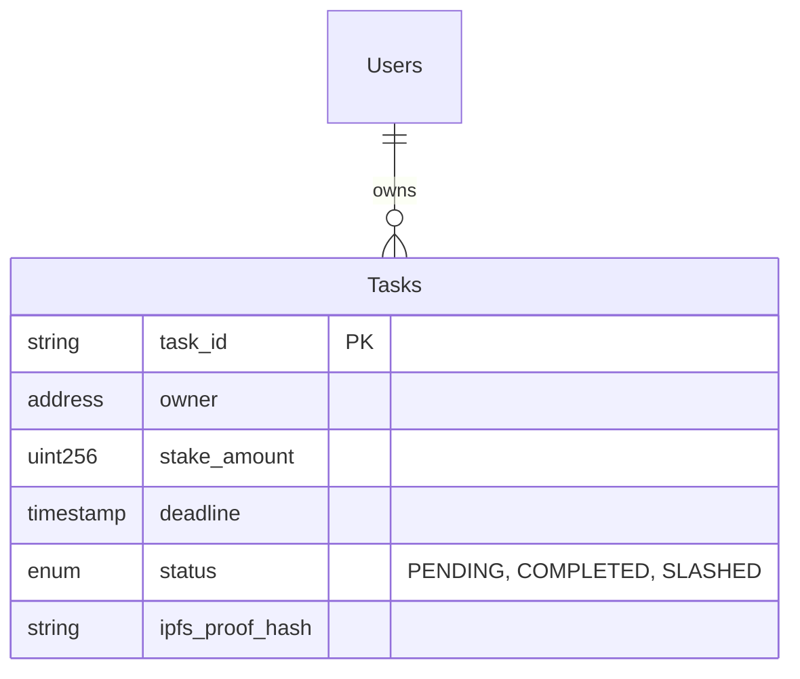

# Mitra Features & User Guide

Welcome to **Mitra**, a multi-agent AI consultancy system. This guide provides a detailed walkthrough of the system's capabilities, using a real-world example project to demonstrate how to leverage the collective intelligence of our agent roster.

---

## 🌟 Core Features

### 1. The Consultancy Model
**"We Plan, You Build."**
Mitra agents act as high-level consultants. They produce comprehensive documentation (PRDs, Specs, Plans) but strictly do **not** write implementation code. This ensures you get architectural guidance without the risk of AI generating buggy or unmaintainable code.

### 2. The Agent Roster
Six specialized agents ready to tackle different aspects of your project.

| Agent | Icon | Role | Focus |
| :--- | :--- | :--- | :--- |
| **Mitra** | 🎼 | Orchestrator | Guidance, Routing, Party Host |
| **Sina** | 📊 | Analyst | Requirements & Strategy |
| **Zal** | 👑 | Manager | Planning & Task Breakdown |
| **Jamshid** | 🏛️ | Architect | Systems, Database, Cloud |
| **Mani** | 🎨 | Designer | UI/UX, Design Systems |
| **Kaveh** | ⚡ | Engineer | Specs, Security, APIs |

### 3. Global Memory System
All agents share a unified memory system.
-   **`*save`**: Persists your current context, including the topic (`crypto-tasker`), key decisions, and artifacts.
-   **`*load`**: Instantly restores the session variables so you can pick up exactly where you left off.

---

## 📘 Real-World Example: "Crypto-Tasker"

To demonstrate Mitra's power, let's build **Crypto-Tasker**: *A decentralized to-do list where users stake ETH to commit to their tasks.*

### Phase 0: Setup & Access
**Goal:** Prepare the environment and connect the AI brains.

1.  **Clone the Repository**
    ```bash
    git clone https://github.com/saeed-vayghan/mitra.git
    cd mitra

    # Config the project
    nano mitra/agents/config.yaml
    ```

2.  **Authenticate LLM Access**
    *   **Google Antigravity IDE**: You have built-in generous access! (Optional: Add your own keys in settings).
    *   **Gemini CLI**: Run `gemini auth login` or export `GEMINI_API_KEY`.
    *   **Claude CLI**: Run `claude login` to authenticate with your subscription.

---

### Phase 1: The Party (Orchestrator)
**Goal:** Brainstorm the initial concept and feasibility.
```
Command: `/mitra:orchestrator` -> Select `*party`

> Mitra: Welcome to the Party! Who should join us today?
> User: I want to build a to-do list on Ethereum. Invite Analyst and Architect.
> Mitra: Inviting Sina (Analyst) and Jamshid (Architect)...
>
> Sina: Interesting concept. What is the penalty for missing a deadline?
> User: You lose your stake. It goes to a charity address.
> Jamshid: That implies a Smart Contract with a time-locking mechanism. We'll need an Oracle or a heartbeat mechanism to verify task completion.
>
> Mitra: [Consensus] Use Smart Contracts for staking. Need mechanism for "Proof of Completion".
```
---

### Phase 2: Requirements (Analyst)
**Goal:** Define the feature set formally.

**Command:** `/mitra:persona:analyst` -> Select `*prd`

**Output:** `docs/consultancy/crypto-tasker/2026-01-09-PRD.md`

```markdown
# Product Requirements Document: Crypto-Tasker
## Core Features
1. **Stake Task**: User locks 0.01 ETH + Deadline.
2. **Verify Task**: User validates completion via photo proof (IPFS).
3. **Claim/Slash**: If verified, ETH returned. If expired, ETH sent to Charity.
```

---

### Phase 3: System Architecture (Architect)
**Goal:** Design the data structure and database.

**Command:** `/mitra:persona:architect` -> Select `*database`

**Output:** `docs/consultancy/crypto-tasker/database-schema.md`

> **Jamshid:** Since this is a dApp, we have a hybrid approach. On-chain state for money, Off-chain state for metadata.



---

### Phase 4: Visuals (Designer)
**Goal:** Design the "Staking" modal.

**Command:** `/mitra:persona:designer` -> Select `*mockup`

**Output:** `docs/consultancy/crypto-tasker/ui-mockups.md`

> **Mani:** Let's make the staking action feel "heavy" and important.
>
> **Component: <StakeModal>**
> - **Header**: "Commit to your Goal"
> - **Input**: "I promise to..." (Text Area)
> - **Input**: "Or I lose..." (ETH Amount Selector)
> - **Action Button**: "Lock Stake (0.05 ETH)" -> Turns Gold on hover.
> - **Micro-interaction**: A lock closing sound effect when clicked.

---

### Phase 5: Technical Specs (Engineer)
**Goal:** Define the API contract for the frontend.

**Command:** `/mitra:persona:engineer` -> Select `*api`

**Output:** `docs/consultancy/crypto-tasker/api-spec.md`

```yaml
paths:
  /tasks/verify:
    post:
      summary: Submit proof of completion
      body:
        taskId: string
        proofImage: file (binary)
      response:
        200:
          txHash: string (The on-chain verification text)
```

---

### Phase 6: Sprint Plan (Manager)
**Goal:** Turn all the above into actionable tickets.

**Command:** `/mitra:persona:manager` -> Select `*breakdown`

**Output:** `docs/consultancy/crypto-tasker/sprint-plan.md`

> **Zal:** Based on Jamshid's specs and Mani's designs, here is the Plan:
>
> **Sprint 1: The Smart Contract**
> - [x] Implement Solidity Contract for Staking
> - [x] Test "Slash" function (time-expiry logic)
>
> **Sprint 2: The Frontend**
> - [ ] Build `<StakeModal>` component (React)
> - [ ] Integrate IPFS upload for proof images

---

## 📂 Implementation
Now that you have the **PRD**, **Database Schema**, **UI Mockups**, **API Spec**, and **Sprint Plan**, you can open your IDE and start coding with absolute clarity.

Mitra has done the thinking. You do the building.
