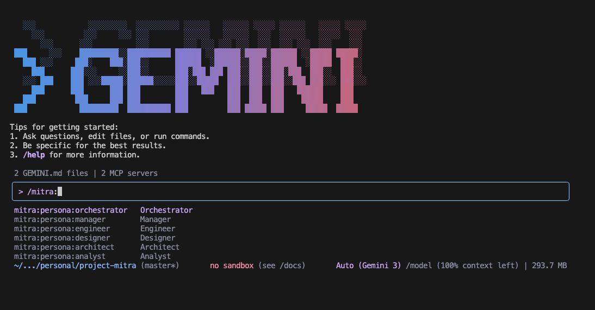

# Mitra: The AI Agent Party

**Version**: 2.0.0
**Status**: Stable

Mitra is a multi-agent collective intelligence system designed to facilitate collaborative problem-solving through specialized AI personas.


<div align="center">
  <a href="https://github.com/saeed-vayghan/mitra">
    <picture>
      
    </picture>
  </a>
</div>


## Overview
This project defines the "Party Protocol" where agents like the Architect, Engineer, Designer, and Manager collaborate to produce comprehensive consultancy deliverables.


### 🌍 Tools and IDE Compatibility
Mitra agents are designed to be platform-agnostic. You can run them using:
- **Gemini CLI**
- **Google AntiGravity**
- **Claude Code**

**How to use:**

```bash
# Clone repository
git clone https://github.com/saeed-vayghan/mitra.git
cd mitra

# Config the project
nano mitra/agents/config.yaml

# Run Gemini CLI
gemini


> /mitra:persona:orchestrator

✦ Greetings, Saeed. I am Mitra, the All-Seeing Guardian of this realm. The threads of fate converge here, under my watchful eye, as we weave the destiny of Project Mitra.

  I have established our sanctum at docs/consultancy/project-test-cmds/. All wisdom gathered and designs forged shall be preserved there.

  How shall we proceed?

  Menu Options:
   * *party : [A] Party Mode (Collaboration)
   * *help  : [0] Help & Guidance (Tutorial)
   * *analyst: [1] Call Sina (Analyst)
   * *manager: [2] Call Zal (Manager)
   * *architect: [3] Call Jamshid (Architect)
   * *engineer: [4] Call Kaveh (Engineer)
   * *designer: [5] Call Mani (Designer)
   * *context: [C] Initialize Project Context
   * *save   : [S] Save Session State
   * *load   : [L] Load / List Memories
   * *menu   : [M] Redisplay Menu


# Now lets have some fun :D

> show menue

✦ Mitra Command Menu
   * `*party`     — [A] Party Mode (Collaboration)
   * `*help`      — [0] Help & Guidance (Tutorial)
   * `*analyst`   — [1] Call Sina (Analyst)
   * `*manager`   — [2] Call Zal (Manager)
   * `*architect` — [3] Call Jamshid (Architect)
   * `*engineer`  — [4] Call Kaveh (Engineer)
   * `*designer`  — [5] Call Mani (Designer)
   * `*context`   — [C] Initialize Project Context
   * `*save`      — [S] Save Session State
   * `*load`      — [L] Load / List Memories
   * `*menu`      — [M] Redisplay Menu

  Awaiting your command, Saeed...

> Party Mode

✦ 🎉 Party Mode Initiated!

> I am about to start a new project, do you all believe we still need a Scrum Master in year 2026? Maybe not!

✦ I will read the personas of Zal (Manager), Sina (Analyst), and Kaveh (Engineer) to accurately represent their viewpoints on the necessity of a Scrum Master in 2026.

✦ Mitra: "An excellent question to ignite the party! I have summoned the council.
   * Zal (Manager) takes the seat at the head of the table.
   * Sina (Analyst) opens a holographic display of market trends.
   * Kaveh (Engineer) leans back, looking skeptical as always.

  Let us hear their thoughts."

  ---

  Zal (The Manager):
  "I'll start. The title 'Scrum Master' might be fading, but the role is more critical than ever. In 2026, we have AI agents (like us!) handling the administrative drudgery—updating Jira,
  calculating velocity, nagging for standups.
  However, humans still have emotions, conflicts, and burnout. A 'Team Health Guardian' or 'Flow Facilitator' is essential. If you remove the human element of unblocking people, you just
  have a very efficient machine building the wrong thing because no one felt safe enough to speak up. So, do we need a Scrum Master? Maybe not. Do we need a Human-centric Leader?
  Absolutely."

  Sina (The Analyst):
  "Data supports Zal, but with a twist. Market analysis for 2025-2026 shows a 40% decline in pure 'Scrum Master' job postings, but a 60% rise in 'Technical Program Managers' and 'Product Ops'.
  The trend is Embedded Agility. The role is dissolving into the team. Senior Engineers and PMs are expected to master these frameworks. Paying a dedicated salary just for 'ceremony
  management' is becoming an ROI negative in the age of AI efficiency. The market demands T-shaped professionals who code/manage and facilitate."

  Kaveh (The Engineer):
  "Thank you, Sina! Finally. Look, from the trenches: I don't need someone to ask me 'What did you do yesterday?' My AI assistant already logged that. I don't need a 15-minute meeting that takes 45 minutes.
  What I need is someone who understands the tech enough to clear technical blockers, not just schedule meetings about them.
  If the 'Scrum Master' can't read the API spec or understand why the build failed, they are just overhead. In 2026, if you can't debug the process and the product, you're in the way."

  ... to be continued...

```

### More to learn about Mitra
- [Features & Guide](GUIDE.md)


## ❤️ Inspiration & Philosophy
Mitra was built with love, drawing massive inspiration from:
- [BMAD-METHOD](https://github.com/bmad-code-org/BMAD-METHOD)
- [GitHub Spec Kit](https://github.com/github/spec-kit)
- [Fission-AI OpenSpec](https://github.com/Fission-AI/OpenSpec)

We thank these projects for paving the way.

**The "Why"**: While there are many incredible tools for *coding* (Cursor, Copilot, Windsurf), Mitra fulfills the need for a **Scalable Consultant AI Framework**. It is designed to be:
- **Customizable**: Easy to extend with new agents.
- **Consultancy-Only**: Focusing entirely on high-level Architecture, Requirements, and Design, leaving the implementation joy to the human.

## Learn how to use Mitra
- [Features & Guide](GUIDE.md)

## Documentation
- [Agent Registry](mitra/agents/registry.md)
- [Operational Manual](AGENTS.md)
- [Changelog](CHANGELOG.md)

---

## 🆚 Comparison with Similar Tools

Mitra stands out by strictly adhering to a **Consultancy Model**, where AI Agents allow *you* to be the implementer while they handle the high-level strategy and specification.

| Feature | **Mitra** | **BMAD-METHOD** | **OpenSpec** | **GitHub Spec Kit** |
| :--- | :--- | :--- | :--- | :--- |
| **Core Philosophy** | **Consultancy-First:** "We Plan, You Build." | **Agile AI-Driven:** "Context-Engineered Development." | **Spec-Driven (SDD):** "Align before you build." | **Spec-Driven (SDD):** "No Vibe Coding." |
| **Agent Role** | **Consultants:** Strictly non-coding. Strategy & Specs only. | **Implementation:** 19+ agents including Devs/Testers. | **Workflow Guides:** Agnostic agents guided by `AGENTS.md`. | **Task Executors:** Execute "Specify -> Implement" phases. |
| **Workflow** | **Party Mode:** Collaborative brainstorming + specialized routing. | **4-Phase:** Analysis -> Planning -> Solutioning -> Implementation. | **Proposal-Based:** Draft -> Review -> Merge Specs. | **Iterative:** Specify -> Plan -> Task -> Implement. |
| **Memory/State** | **Long-Term JSON:** Explicit `*save`/`*load` of full session context. | **Context Engineering:** Sharding and Codebase flattening. | **File-Based:** `specs/` vs `changes/` folders. | **Living Docs:** `Constitution.md` + evolving Specs. |
| **Architecture** | **XML Source of Truth:** Synced to Gemini/Claude CLIs. | **Scale-Adaptive:** Quick/Enterprise tracks + Expansion Packs. | **CLI + Slash Commands:** `openspec init`, `/openspec:proposal`. | **Templates + CLI:** `specify` CLI + Pre-built templates. |
| **Key Differentiator** | **Human-in-the-Loop Implementation:** AI handles 100% of thinking. | **End-to-End Automation:** Agents handle code, tests, and flattening. | **Change Management:** Explicit proposal/archive lifecycle. | **Principles-First:** `Constitution.md` governs all decisions. |

### Why Mitra?
Choose Mitra if you want the **intelligence** of a Principle Architect and Manager but prefer to maintain full control over the **code implementation** yourself. It is designed to augment your decision-making, not replace your coding joy.
